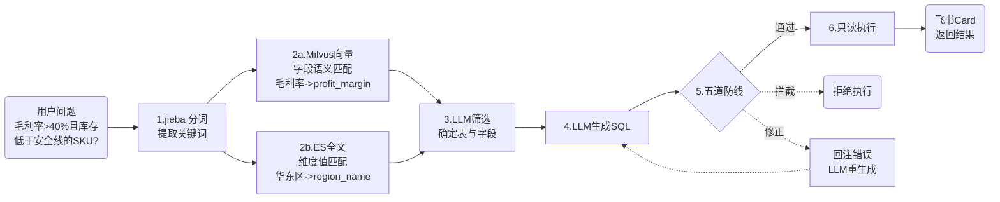
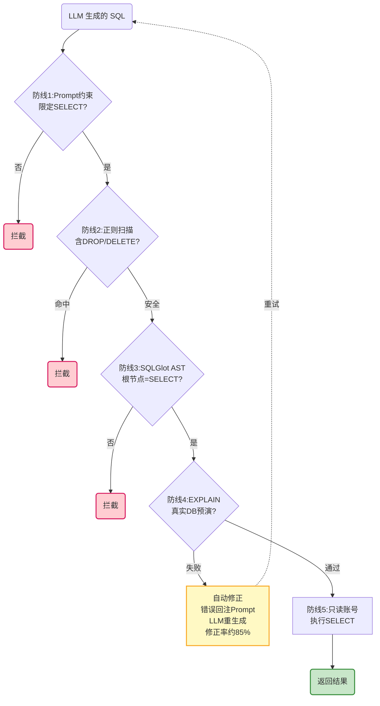

# 飞书AI电商数据助手Agent — 工具与术语参考手册

> 面试前快速复习。按追问频次标记星级，核心技术区附带「面试官怎么问 → 怎么答」。

---

## 一、Agent 框架 & LLM 编排 🔥🔥🔥

> **一句话定位**：LangGraph 是骨架（状态机控制流转），LangChain 是血肉（节点内调 LLM/工具）。

| 术语 | 面试追问 | 答题要点 |
|------|----------|---------|
| **LangGraph** | "为什么不用 LangChain AgentExecutor？" | **可控性**：显式 StateGraph 有向图——每个节点、每条边都可观测、可中断(interrupt)、可持久化(Checkpointer)。AgentExecutor 是黑盒自主循环，出问题没法定位。 |
| **StateGraph** | "图里的状态怎么传？" | TypedDict 定义 AgentState（user_input/intent/sql/answer），节点间共享；条件边根据 state 字段决定下一跳，不是 LLM 决策。 |
| **Conditional Edge** | "路由是 LLM 决定的吗？" | **不是**。意图识别是 LLM（语义理解），但 SQL 校验通过→执行、失败→修正，这种确定性分支走条件边（代码判断），不浪费 token。 |
| **Checkpointer** | "对话怎么记住上下文？" | LangGraph 每步 state 持久化到 SQLite（save_history 节点同库）；支持暂停/恢复——人工确认后再继续，人机协同的基础。 |
| **interrupt** | "人机协同怎么做的？" | 高风险节点（如自动补货）执行到即挂起，等待运营在飞书卡片上点「确认」后恢复。 |
| **Prompt Engineering** | "NL2SQL 的 Prompt 有什么特殊？" | Temperature=0（确定性生成）、"只生成 SELECT"、"禁止 Markdown 代码块"、"如果字段不确定返回候选让用户选"。 |
| **LangChain** | "LangGraph 和 LangChain 什么关系？" | 分工：节点内用 LangChain 调 LLM/定义 Tool，节点间用 LangGraph 控制流转。同一生态。 |

---

## 二、Agent 协议 & 工具标准化 🔥🔥🔥

> **MCP = 工具的 USB 接口**：插什么 ERP 都行，Agent 代码不用改。

| 术语 | 面试追问 | 答题要点 |
|------|----------|---------|
| **MCP** | "MCP 解决了什么问题？" | **Agent 与工具解耦**。库存查询工具签名固定（`get_inventory(sku, platform)`），底层 Mock/店小秘/领星/Amazon SP-API 通过适配器切换，Agent 图一行不改。 |
| **FastMCP** | "为什么不手写 MCP 协议？" | `@mcp.tool()` 装饰器一秒定义工具——自动生成 description + input schema，省掉协议样板代码。 |
| **A2A** | "为什么需要 A2A？MCP 不够吗？" | MCP 是人→工具，A2A 是 Agent→Agent。跨组织协作场景（如 FAQ Agent 委托订单 Agent 查订单），Agent Card 声明能力，JSON-RPC 2.0 异步委托。 |
| **Function Calling** | "Function Calling 和 MCP 的区别？" | FC 是 LLM 调用工具的能力（返回 tool_calls JSON），MCP 是工具的定义协议。两者互补——FC 负责调，MCP 负责标准化。 |

---

## 三、NL2SQL 管线与安全 🔥🔥🔥

> **管线全景**：用户说人话 → `jieba` 分词 → `Milvus + ES` 三路并行召回 → `LLM` 筛选表字段 → `LLM` 生成 SQL → **五道防线** → 只读执行 → 返回。

### 3a. 检索与生成

| 术语 | 面试追问 | 答题要点 |
|------|----------|---------|
| **NL2SQL** | "准确率怎么从 60% 提到 85%？" | **不是让 LLM 直接写 SQL**。先 jieba 分词 → Milvus 向量检索精确匹配字段名/指标（"毛利率"→`profit_margin` 列），ES 全文匹配维度值（"华东区"→`region_name`），LLM 只负责最终筛选和 SQL 生成。上下文精准了，SQL 才准。 |
| **jieba** | "第一步怎么抽关键词？" | TF-IDF 提取中文实体与名词，产出 `["华东区","毛利率","SKU"]`，作为三路召回的检索种子。 |
| **Milvus** | "为什么选 Milvus 而不是 FAISS/Qdrant？" | **国内生态 + 扩展成本**。字节/小米/快手都在用，分布式开源免费支持十亿级向量。FAISS 是单机库，量大了要自己搭分布式。负责同义不同字匹配（"毛利率" ↔ `profit_margin`）。 |
| **Elasticsearch** | "有 Milvus 还不够？为什么加 ES？" | **字面混淆问题**。"华东"和"华北"向量空间距离很近（语义相似），但它们是两个不同的维度值。ES 用 BM25 做精确文本匹配，不会被向量误导。 |
| **元数据知识库** | "Schema 怎么让 LLM 知道？" | 表名、列名、数据类型、业务含义、示例值、主外键关系全部结构化存储。检索引擎返回 top-K 候选，LLM 从中筛选真正相关的表和字段，塞进 Prompt 再生成 SQL。 |

### 3b. 安全五道防线

| 术语 | 面试追问 | 答题要点 |
|------|----------|---------|
| **防线1:Prompt约束** | "Prompt 防得住吗？" | 第一道也是最低成本的——System Prompt 写死"只生成 SELECT"。LLM 可能会忽略，所以后面还有四道。 |
| **防线2:正则扫描** | "正则不会被绕过吗？" | 确实可能——所以只是第二道快筛。匹配到 DROP/DELETE/INSERT/UPDATE/TRUNCATE 直接拦截，不进入后续流程。 |
| **防线3:SQLGlot AST** | "为什么不用正则验证 SQL 结构？" | **正则看不懂语法**。SQLGlot 把 SQL 解析成抽象语法树，校验根节点必须是 SELECT——用正则判断"是不是 SELECT"容易被 `/* SELECT */ DROP TABLE` 绕过。 |
| **防线4:EXPLAIN** | "EXPLAIN 能抓到什么问题？" | 在真实数据库预演（不读写数据）——表不存在、列名拼错、语法错误都能抓到。**失败了不直接报错，把错误信息回注 Prompt 让 LLM 自动修正一次，修正率约 85%**。 |
| **防线5:只读账号** | "前四道都绕过了怎么办？" | 数据库连接用只读账号——就算 LLM 生成了 DELETE，数据库权限直接拒绝。最后兜底。 |
| **Temperature=0** | "为什么 SQL 生成用 0 温度？" | SQL 是确定性任务——同一问题每次应输出完全一致的 SQL。温度>0 会导致同一问题两次生成的 SQL 不同，排查问题很痛苦。 |

---

## 四、向量库 & 检索引擎 🔥🔥

| 术语 | 面试追问 | 答题要点 |
|------|----------|---------|
| **BM25** | "BM25 和向量检索有什么区别？" | BM25 是字面匹配（"华东"≠"华北"），向量是语义匹配（"毛利率"≈"利润率"）。**互补**——一个解决精确枚举，一个解决同义表达。 |
| **RRF** | "两路召回结果怎么合并？" | Reciprocal Rank Fusion——对各路排名取倒数加权，数学上公平融合。比简单拼接更合理——两路都排前面的结果自然排在最终列表前面。 |
| **Cross-Encoder Rerank** | "RRF 之后为什么还要精排？" | RRF 是粗排（只看排名不看内容），Cross-Encoder 把查询和文档同时输入模型做深度语义匹配，筛掉"排名高但语义不匹配"的结果，减少 LLM 幻觉。 |
| **Embedding / BGE** | "Embedding 模型怎么选的？" | 智源 BGE-large-zh-v1.5——中文 Embedding 榜单长期第一，开源可私有化部署。Docker + TEI 推理服务部署。 |
| **FAISS** | "FAISS 和 Milvus 怎么选？" | FAISS 是单机库——轻量、CPU 友好，适合小规模 RAG（文档量<10 万）。Milvus 是分布式库——十亿级向量、水平扩展，适合生产级 NL2SQL 元数据检索。 |

---

## 五、飞书集成 🔥🔥

| 术语 | 面试追问 | 答题要点 |
|------|----------|---------|
| **WebSocket** | "为什么不用 HTTP Webhook？" | 不需要公网 IP——`feishu_ws.py` 独立子进程主动连飞书服务器，内网开发/部署都方便。 |
| **Interactive Card** | "为什么要用 Card 而不是纯文本？" | **流式渲染**——先发空卡片 `create` → 分析到哪补到哪 `patch` → 完成 `freeze`。运营看到结果一步步出来，体感远好于干等几秒。 |
| **Guardrails** | "安检做了什么？" | 消息进 Agent 前先过滤敏感词（政治/暴力/赌博），非电商话题引导到帮助 Skill。 |
| **飞书多维表格** | "为什么监控看板用飞书表格？" | APScheduler 每小时推 LLM 调用量/Skill 耗时/错误数到 Bitable，团队直接在飞书里看，不用额外装监控系统。 |

---

## 六、LLM 模型 & 成本 🔥🔥

| 术语 | 面试追问 | 答题要点 |
|------|----------|---------|
| **DeepSeek V4 Pro** | "为什么选 DeepSeek 而不是 GPT-4？" | **成本**——API 价格约 GPT-4 的 1/20，中文 NL2SQL 效果够用。意图路由+SQL 生成主力模型。 |
| **GPT-4o** | "什么时候用 GPT-4o？" | 复杂分析场景（选品分析、竞品报告）——DeepSeek 推理深度不够时切换。混合模型路由：简单查询走 DeepSeek，复杂分析走 GPT-4o。 |
| **Temperature** | "不同场景温度怎么设？" | SQL 生成=0（确定性），文案生成=0.7（有创意），意图识别=0.3（稳定但不僵硬）。 |
| **Token 预算** | "成本怎么控制？" | 日预算 50 万 token；简单查询直接缓存；复杂查询才调 LLM。 |

---

## 七、电商工具链 🔥🔥

> 合并原第七节（行业工具）+ 第十三节（平台工具）。去重：店小秘/领星/马帮/影刀/n8n/易仓 各只出现一次。

| 工具 | 类型 | 与 Agent 的关系 |
|------|------|----------------|
| **店小秘** | 跨境电商 ERP | MCP 适配器之一——通过 API 查库存/订单/销售 |
| **领星 ERP** | 跨境电商 ERP | MCP 适配器之一——市占率第一，29+ 预警模型，智能补货建议数据源 |
| **马帮 ERP** | 跨境电商 ERP | 另一个可适配的 ERP，对接 170+ 平台 |
| **易仓 WMS** | 仓储管理 | Agent 查物流和实时库存的 WMS 数据源，对接 800+ 海外仓 |
| **影刀 RPA** | 电商自动化 | RPA vs Agent 的分工——RPA 做重复性 UI 操作（批量上架/对账），Agent 做意图理解和动态查询 |
| **n8n** | 工作流自动化 | 2025-2026 年电商自动化新趋势——可视化编排、JS 自定义节点，比影刀更开发友好 |
| **Amazon SP-API** | 平台 API | MCP 适配器终极目标——直连 Amazon，不经过 ERP |
| **千牛** | 国内平台工具 | 淘宝/天猫卖家工作台 |
| **生意参谋** | 数据分析 | 阿里官方——流量/转化/竞品 |
| **抖音罗盘** | 数据分析 | 抖音电商官方——直播/短视频/商品卡 |
| **蝉妈妈/飞瓜** | 第三方分析 | 抖音达人数据/爆品追踪 |
| **1688** | 采购货源 | 跨境电商主要供货来源 |

---

## 八、电商基础术语 🔥

> 理解业务语境时用到。Agent 对话中高频出现。

| 术语 | 说明 | Agent 场景 |
|------|------|-----------|
| **SKU** | 库存量单位，商品唯一标识 | 查询基本单位——"SKU001 昨天卖了多少" |
| **SPU** | 标准化产品单元（一个 SPU = 多个 SKU） | 品类分析聚合维度 |
| **GMV** | 商品交易总额 | 销售分析核心指标 |
| **ASIN** | Amazon 商品唯一 ID | Amazon 平台商品标识 |
| **安全库存** | 防止断货的最低库存量 | 库存预警 Skill 判断阈值 |
| **超卖** | 库存显示有货但实无货 | 多平台库存同步延迟的核心痛点 |
| **断货** | 爆款库存耗尽 | 直接损失 GMV |

---

## 九、运营指标速查 🔥

> Agent 分析报告中的核心指标。了解含义即可，不需要背公式。

| 指标 | 一句话 | 分类 |
|------|--------|------|
| **CVR** | 转化率 = 下单/访客 | 流量效率 |
| **AOV** | 客单价 = GMV/订单数 | 用户消费力 |
| **CTR** | 点击率 = 点击/展示 | 广告质量 |
| **CPC** | 单次点击成本 | 广告效率 |
| **ROI** | (收入-成本)/成本 | 投入产出 |
| **ROAS** | GMV/广告花费 | 广告回报（≠利润） |
| **毛利率** | (收入-商品成本)/收入 | 商品盈利能力 |
| **动销率** | 有销量SKU/总SKU | 库存健康度 |
| **滞销品** | 一定周期零销量 SKU | 库存预警对象 |

---

## 十、库存与供应链 🔥

> 库存预警 Skill 的业务基础。

| 术语 | 说明 |
|------|------|
| **采购周期** | 下单到入库天数——安全库存公式核心参数 |
| **ABC 分类** | A 类（前 20% 高价值）重点监控，C 类（后 50%）定期清理 |
| **FBA** | Amazon 仓配一体——发到 Amazon 仓库，平台负责配送 |
| **FBM** | 卖家自发货——大件/定制商品常用 |
| **海外仓** | 目标市场提前备货，本地发货比国内直发快 5-15 天 |
| **选品** | 电商第一关——分析市场/竞争/利润决定卖什么 |

---

## 十一、工程化 & 运维 🔥🔥

| 术语 | 面试追问 | 答题要点 |
|------|----------|---------|
| **FastAPI** | "为什么选 FastAPI？" | 异步高性能（接近 Node.js）+ Pydantic 自动校验 + 飞书 WS 子进程管理。 |
| **Docker Compose** | "本地开发环境怎么搭？" | MySQL + Milvus + ES + TEI 四个容器一键启动，新人 5 分钟跑起来。 |
| **APScheduler** | "定时任务怎么做？" | 定时扫描低库存 SKU + 每小时同步监控指标到飞书多维表格。 |
| **SQLite** | "Checkpointer 状态存哪？" | 对话记录 + 状态持久化（save_history 节点）——单文件轻量、免部署，重启不丢；数据层不用 PostgreSQL（数仓=MySQL、向量=Milvus、全文=ES，背诵版 Q6.5 红线）。 |
| **Redis** | "Redis 在 Agent 里怎么用？" | 对话缓存（最近 10 条内存 + DB 双写）、高频查询缓存、LLM 停止信号。 |
| **MonitoringStats** | "监控怎么做的？" | 自研——LLM 调用次数/Skill 耗时/错误数全记录，APScheduler 每小时推到飞书多维表格看板。 |

---

## 十二、RAG 文档处理 🔥🔥

> **管线全景**：文档上传 → `MinerU/PyMuPDF/PaddleOCR` 解析 → `simhash` 去重 → 智能分块 → `BM25 + 向量` 双路召回 → `RRF` 融合 → `Cross-Encoder` 精排 → 分数阈值拦截低分 → LLM 生成回答。

| 术语 | 面试追问 | 答题要点 |
|------|----------|---------|
| **RAG** | "为什么用 RAG 而不是微调？" | 文档会变——微调要重训，RAG 只需重建索引。且 RAG 可溯源——每个回答都能指回是哪个文档的哪段。 |
| **MinerU** | "PDF 解析为什么不用 PyMuPDF？" | MinerU 保留双栏/表格/公式结构——对于 born-digital PDF，比 PyMuPDF 更保持原文布局。扫描件走 PaddleOCR。 |
| **simhash** | "文档去重怎么做的？" | 相似文档生成相近哈希——内容高度重复的文档入库前去重，减少检索噪音。 |
| **智能分块** | "分块有什么讲究？" | 不按字符数硬切——按段落/表格/列表边界切分，保持语义完整。块太大检索不准，太小缺少上下文。 |
| **RAGAS** | "RAG 效果怎么评估？" | 从客服历史对话挖 500+ 真实问题，人工标注后跑 RAGAS（context recall/faithfulness/relevancy），每次调参自动回归验证。 |

---

## 十三、面试高频缩写速查

| 缩写 | 全称 | 频次 |
|------|------|:----:|
| **MCP** | Model Context Protocol | 🔥🔥🔥 |
| **NL2SQL** | Natural Language to SQL | 🔥🔥🔥 |
| **A2A** | Agent-to-Agent | 🔥🔥 |
| **RAG** | Retrieval-Augmented Generation | 🔥🔥🔥 |
| **RRF** | Reciprocal Rank Fusion | 🔥🔥 |
| **BM25** | Best Matching 25 | 🔥🔥 |
| **RAGAS** | RAG Assessment | 🔥🔥 |
| **SKU** | Stock Keeping Unit | 🔥 |
| **SPU** | Standard Product Unit | 🔥 |
| **GMV** | Gross Merchandise Volume | 🔥 |
| **CVR** | Conversion Rate | 🔥 |
| **ROI** | Return on Investment | 🔥 |
| **ROAS** | Return on Ad Spend | 🔥 |
| **ERP** | Enterprise Resource Planning | 🔥🔥 |
| **WMS** | Warehouse Management System | 🔥 |
| **FBA** | Fulfillment by Amazon | 🔥 |
| **OCR** | Optical Character Recognition | 🔥 |
| **AST** | Abstract Syntax Tree | 🔥🔥🔥 |
| **SSE** | Server-Sent Events | 🔥 |
| **ODR** | Order Defect Rate | 🔥 |
| **VAT** | Value Added Tax | 🔥 |
