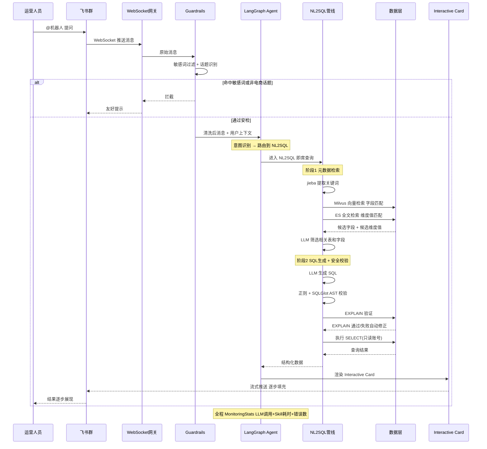
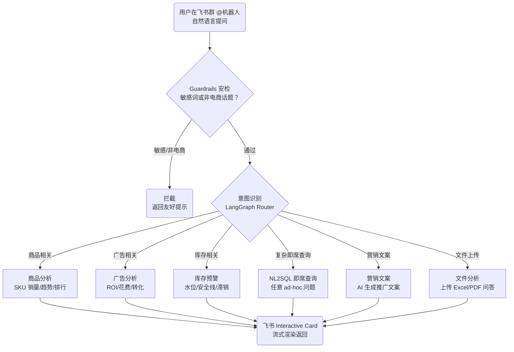
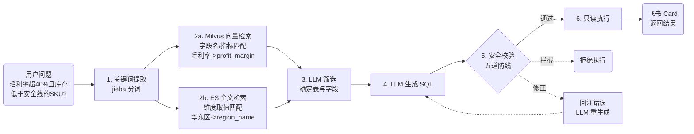
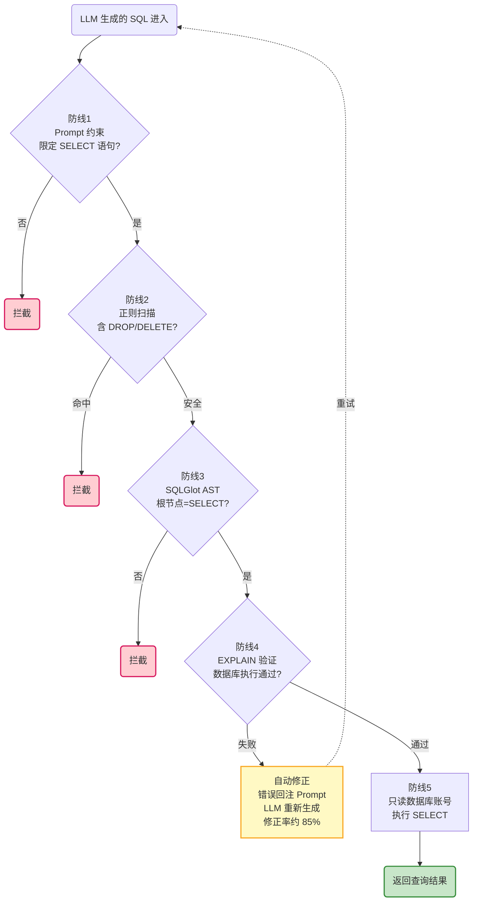
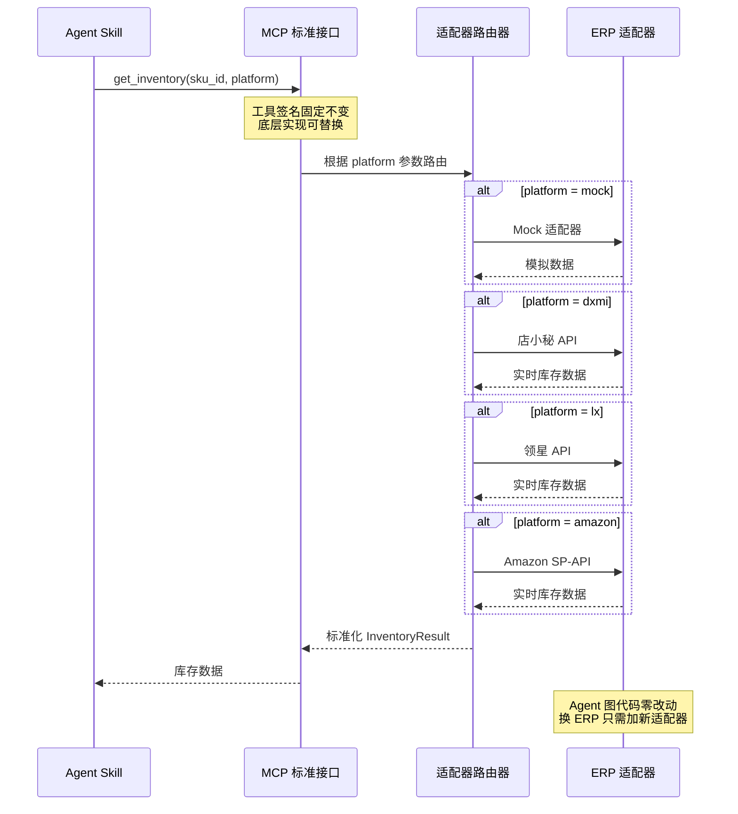

# 飞书 AI 电商数据 Agent — 业务流程图

> 基于张云阳简历中「飞书 AI 电商数据 Agent」项目绘制。Mermaid 兼容版。

## 一、主流程：用户提问 → 飞书返回结果

## 二、六大业务场景路由流程

## 三、NL2SQL 管线（核心亮点）

> 拆为两张图：管线概览走通全流程，安全防线放大看细节。

### 3a. 核心管线概览（4 阶段）

### 3b. 安全五道防线（放大详图）

## 四、MCP 工具调用流程（适配器模式）

## 五、结果呈现流程（飞书 Interactive Card 流式渲染）

## 业务流程速查

| 阶段 | 关键步骤 | 技术实现 | 时间 |
|------|----------|----------|------|
| 接收 | 飞书群 @机器人 | WebSocket 长连接 | 实时 |
| 安检 | 敏感词 + 话题过滤 | Guardrails | <100ms |
| 路由 | 意图识别 → 6 大场景 | LangGraph Router | <500ms |
| 检索 | jieba → Milvus + ES 双路 | 向量 + 全文混合检索 | ~1s |
| 生成 | LLM 选表 → 生成 SQL | Prompt Engineering | ~2s |
| 安全 | 五道防线逐一校验 | 正则 + AST + EXPLAIN | ~500ms |
| 执行 | 只读账号 SELECT | MySQL 数仓 | <1s |
| 返回 | Interactive Card 流式 | 飞书卡片 API | 流式，边算边出 |
| 总计 | 一次查询平均 | 端到端 | **~5s** |
