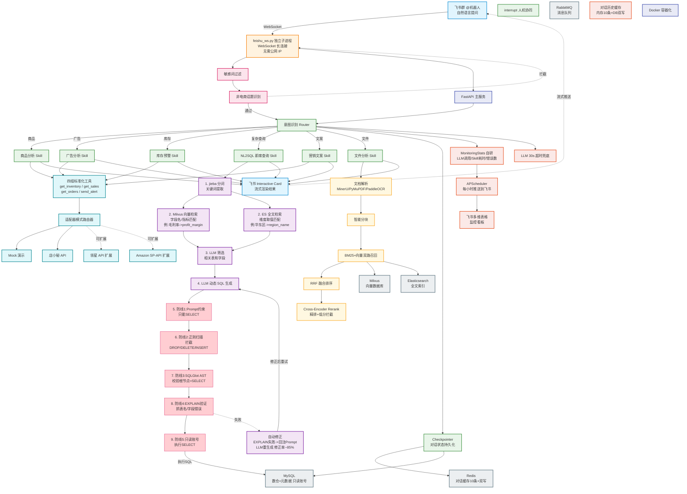

# 飞书 AI 电商数据 Agent — 系统架构图

> 基于「飞书 AI 电商数据 Agent」项目实际架构绘制。Mermaid 兼容版，可在 VS Code / GitHub / Mermaid Live Editor 中直接渲染。

## 架构分层速查

| 层级 | 颜色 | 核心组件 | 关键技术 |
|------|------|----------|----------|
| 🔵 用户入口 | 浅蓝 | 飞书群 @机器人 + Interactive Card | 流式渲染，唯一入口 |
| 🟠 网关层 | 浅橙 | feishu_ws.py | WebSocket 独立子进程，无需公网 IP |
| 🔴 安检层 | 浅粉 | Guardrails | 敏感词 + 非电商话题过滤 |
| 🟢 Agent 编排 | 浅绿 | LangGraph StateGraph | 条件边路由 / Checkpointer / interrupt |
| 🟣 NL2SQL | 浅紫 | jieba + Milvus + ES + SQLGlot | 双路检索 + 五道安全防线 + 自动修正 |
| 🔵 MCP 工具 | 浅青 | 适配器模式 | 标准接口 get_inventory/get_sales/get_orders/send_alert |
| 🟡 RAG 检索 | 浅黄 | MinerU + BM25 + Cross-Encoder | 双路召回 + RRF 融合 + 精排拦截 |
| ⬜ 数据层 | 灰 | MySQL / Redis / Milvus / ES | 混合存储（数仓+对话缓存+向量+全文），只读账号兜底 |
| 🟤 监控容错 | 浅棕 | MonitoringStats 自研 | APScheduler -> 飞书多维表格看板 |
| 🔵 基础设施 | 靛蓝 | FastAPI + Docker | 主服务 + 容器化 |
